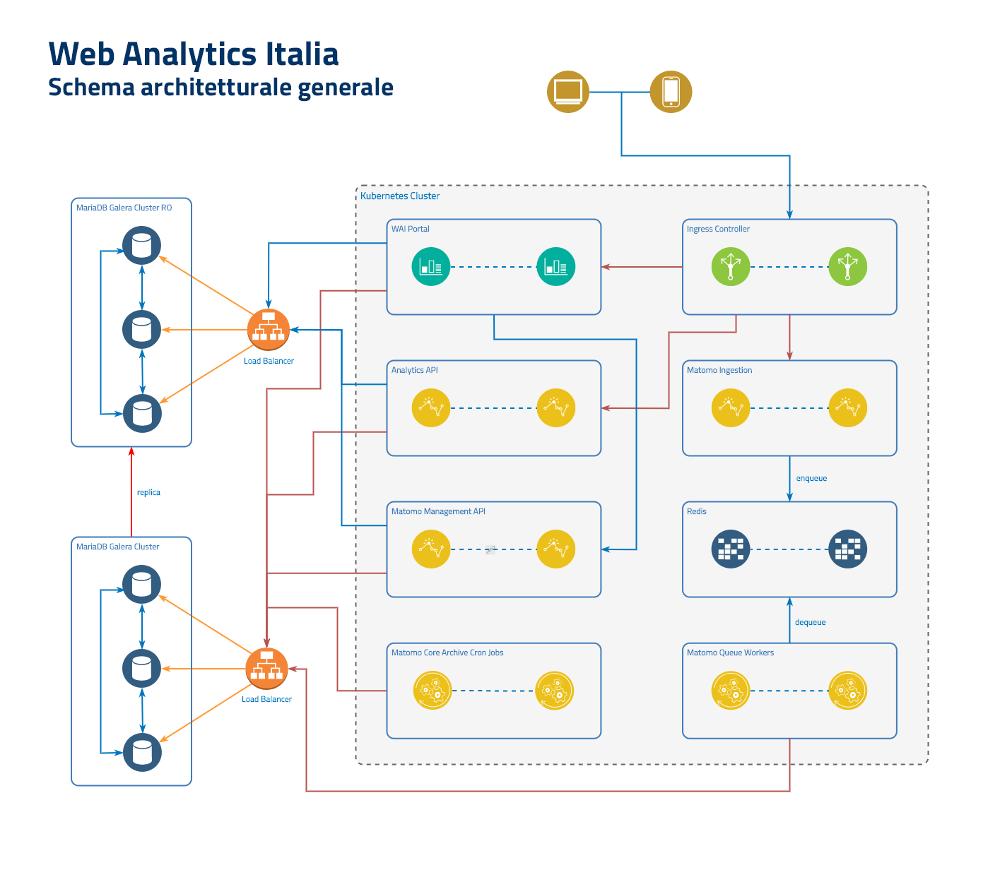

# Web Analytics Italia - Infrastructure

[](https://github.com/AgID/wai-infrastructure/actions/workflows/ci.yml)

Il repository contiene gli script di installazione e configurazione di tutte le
componenti infrastrutturali e del software di base della piattaforma
[Web Analitycs Italia](https://webanalytics.italia.it/).

Di seguito l'infrastruttura applicativa e la dislocazione delle componenti.



## Requisiti

Installare le dipendenze con:

```bash
$ pip install -r requirements.txt
```

Per l'installazione è necessario utilizzare un host locale o remoto come
**controller**; su questa macchina è necessario creare la chiave RSA per
l'accesso tramite ssh utilizzando il comando:

```bash
$ ssh-keygen -t rsa -b 4096 -N '' -f ssh_wai_key
```

Il comando creerà una copia di chiavi (pubblica e privata) che saranno
utilizzate per l'accesso agli host dell'infrastruttura.

## Provisioning a livello IaaS

Per il provisioning dell'infrastruttura presso il servizio SPC Cloud - Lotto 1,
è disponibile lo script `infrastructure/wai-provisioner.py` che automatizza la
procedura di creazione di tutte le risorse previste (reti, gruppi di protezione,
istanze, volumi, etc.).

Prima di utilizzare lo script è necessario creare i file che descrivono gli
ambienti utilizzado i template disponibili
(`infrastructure/env-*.tfvars.template`) e copiandoli/rinominandoli senza
l'estensione `.template`.

Nel file `env-common.tfvars` va inserita la chiave **pubblica** generata
precedentemente.

Le credenziali per l'accesso al cloud provider devono essere caricate come
variabili d'ambiente. Il modo più semplice è utilizzare il [file _OpenStack
RC_](https://docs.openstack.org/newton/user-guide/common/cli-set-environment-variables-using-openstack-rc.html#download-and-source-the-openstack-rc-file).

Se non si desidera utilizzare lo script è possibile usare direttamente
[Terraform](https://www.terraform.io/) avendo cura di creare tre distinti
workspace per ciascuno degli ambienti previsti: `production`, `staging` e
`public-playground`.

### Utilizzo

Per la creazione/aggiornamento delle risorse nell'infrastruttura:

```bash
$ infrastructure/wai-provisioner.py <environment> apply
```

Per la distruzione delle risorse nell'infrastruttura (senza possibilità di
recupero):

```bash
$ infrastructure/wai-provisioner.py <environment> destroy
```

Il parametro `<environment>` può assumere uno dei tre valori: `production`,
`staging` o `public-playground`.

## Installazione

Per l'installazione e configurazione del software di base e delle componenti
infrastrutturali è stato realizzato il playbook
[Ansible](https://www.ansible.com/) `wai.yml`; il playbook è realizzato per la
versione del sistema operativo Ubuntu Server 18.04 LTS.

### Inventory dinamico

Lo script `playbooks/inventory/10-openstack_inventory.py` è utilizzato da
Ansible per la generazione di un inventory dinamico a partire dalle risorse
create. Accanto a questo è presente anche un inventory statico
(`playbooks/inventory/20-k8s-static-inventory`) necessario per l'installazione
del cluster Kubernetes.

Anche questo script necessita che le credenziali per l'accesso al cloud provider
siano caricate come variabili d'ambiente.

L'inventory è selezionato automaticamente mediante la configurazione di ansible
presente nel file `playbooks/ansible.cfg`, quindi non è necessario specificarlo
nella riga di comando.

### Ruoli e playbook esterni

Prima di lanciare il playbook è necessario installare alcuni ruoli tra cui
quello relativo all'installazione di
[Elasticsearch](https://www.elastic.co/products/elasticsearch):

```bash
$ ansible-galaxy install -r playbooks/requirements.yml
$ ansible-galaxy collection install -r playbooks/requirements-collection.yml
```

L'installazione del cluster [Kubernetes](https://kubernetes.io/) è effettuata
mediante il playbook esterno
[kubespray](https://github.com/kubernetes-sigs/kubespray) che deve essere quindi
clonato dal suo repository:

```bash
$ git clone --branch v2.12.0 https://github.com/kubernetes-sigs/kubespray.git playbooks/kubespray
```

### Ruoli

Il playbook per l'installazione di Web Analytics Italia contiene i seguenti
ruoli:

- *infrastructure*: utilizzato per alcuni task di preparazione degli host;
- *elastic.elasticsearch*: installazione di Elasticsearch tramite i ruoli
  installati con `ansible-galaxy`;
- *kibana*: installazione di [Kibana](https://www.elastic.co/products/kibana);
- *glusterfs*: installazione di [GlusterFS](https://www.gluster.org/);
- *mariadb*: installazione di [MariaDB](https://mariadb.com/);
- *galera*: configurazione dei cluster [Galera](https://galeracluster.com/)
- *kubernetes*: installazione del cluster
  [Kubernetes](https://kubernetes.io/) con il playbook esterno
  [kubespray](https://github.com/kubernetes-sigs/kubespray);
- *openvpn_server*: installazione di un server [OpenVPN](https://openvpn.net/);
- *prometheus_mysqld_exporter* e *prometheus_node_exporter*: installazione di
  exporters per la raccolta di metriche con [Prometheus](https://prometheus.io/);

### Tags

Il playbook contiene diversi tag che è possibile consultare dal playbook
[`wai.yml`](playbooks/wai.yml).

### Parametri

Tutti i parametri generali modificabili sono disponibili nel file
[`all.yml`](playbooks/inventory/group_vars/all.yml).

#### Parametri sensibili

Il playbook per il deploy dell'infrastruttura e la configurazione del software
di base utilizza il file [`secrets.yml`](playbooks/secrets.yml) per leggere
tutti i parametri che vanno tenuti segreti per motivi di sicurezza.

Per condividere il file `secrets.yml`, è possibile utilizzare `ansible-vault`.

Dopo aver impostato i parametri all'interno del file, si può criptare con il
comando:

```bash
$ ansible-vault encrypt playbooks/secrets.yml
```

Decriptare il file `secrets.yml`, utilizzando la password impostata con il
comando:

```bash
$ ansible-vault decrypt playbooks/secrets.yml
```

### Esecuzione Playbook

Prima dell'esecuzione del playbook è possibile verificare la raggiungibilità di
tutti gli host presenti nell'inventory con il comando:

```bash
$ ansible all -m ping --limit 'wai'
```

Per l'installazione è consigliabile usare questa sequenza ordinata di tag con il
comando:

```bash
$ ansible-playbook playbooks/wai.yml -b --limit 'wai' --tags=<tag>
```

1. *infrastructure*: controlli iniziali sui requisiti;
2. *openvpn*: server OpenVPN;
3. *elastic,kibana*: ElasticSearch e Kibana;
4. *galera,mariadb*: DBMS e cluster;
5. *gluster*: GlusterFS;
6. *matomo*: database Matomo;
7. *kubernetes*: cluster Kubernetes;
8. *elastic-deploy*: risorse di ElasticSearch;
9. *kubernetes-deploy*: risorse di Kubernetes;
10. *kubernetes-deploy-helm*: risorse di Kubernetes via Helm;

Per generare in ambiente locale tutti i file relativi ai template si può
usare il tag _templates_:

```bash
$ ansible-playbook playbooks/wai.yml -i playbooks/inventory/30-localhost -t templates
```

## Immagini per i container

Le immagini docker usate per i container sono disponibili pubblicamente nella
pagina dell'organizzazione
[Web Analytics Italia](https://hub.docker.com/u/webanalyticsitalia) su Docker
Hub.
