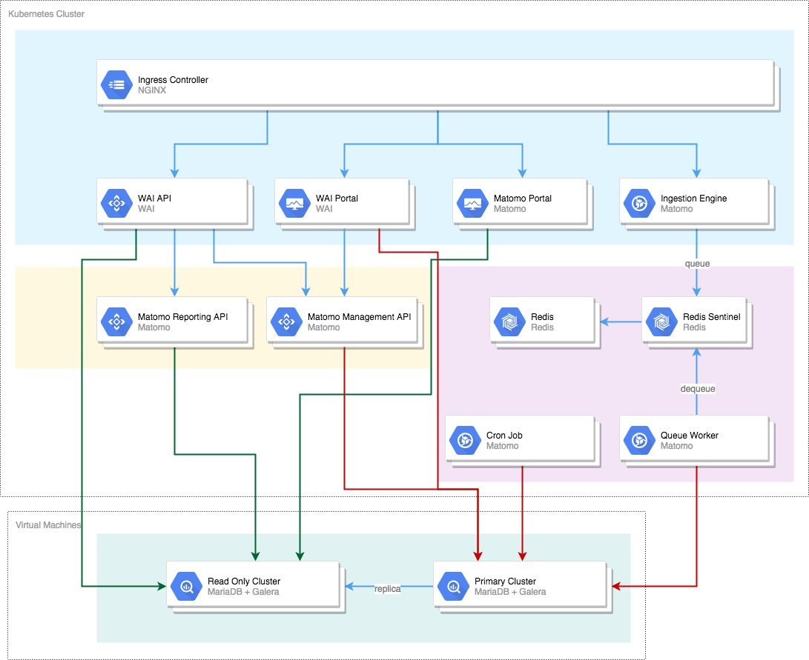

# WAI - Kubernetes

Il repository contiene gli script di installazione e configurazione di tutte le componenti infrastrutturali e del software di base della soluzione Web Analitycs Italia, WAI:

1. Installazione pacchetti software
2. Kubernetes
3. MariaDB con Galera
4. GlusterFS
5. Elasticsearch
6. Immagini docker
7. Script di deployment di Kubernetes

Di seguito l'infrastruttura applicativa e la dislocazione delle componenti.

 

Per la descrizione della infrastruttura fare riferimento alla documentazione consultabile a questo [link]() ed al capacity plan presente a questo [link]().

## Provisioning

Per il provisioning dell'infrastruttura presso il servizio SPC Cloud - Lotto 1,
è disponibile lo script `infrastructure/wai-provisioner.py` che automatizza la
procedura di creazione di tutte le risorse previste (reti, gruppi di protezione,
istanze, volumi, etc.).

### Requisiti

Installare le dipendenze con:

```bash
$ pip install -r requirements.txt
```

Prima di utilizzare lo script è necessario creare i file che descrivono gli
ambienti utilizzado i template disponibili
(`infrastructure/env-*.tfvars.template`) e copiandoli/rinominandoli senza
l'estensione `.template`.

Le credenziali per l'accesso al cloud provider devono essere caricate come
variabili d'ambiente. Il modo più semplice è utilizzare il [file _OpenStack
RC_](https://docs.openstack.org/newton/user-guide/common/cli-set-environment-variables-using-openstack-rc.html#download-and-source-the-openstack-rc-file).

### Utilizzo

Per la creazione/aggiornamento delle risorse nell'infrastruttura:

```bash
$ infrastructure/wai-provisioner.py <environment> apply
```

Per la distruzione delle risorse nell'infrastruttura (senza possibilità di
recupero):

```bash
$ infrastructure/wai-provisioner.py <environment> destroy
```

Il parametro `<environment>` può assumere uno dei tre valori: `production`,
`staging` o `public-playground`.

### Inventory dinamico

Lo script `infrastructure/inventory/openstack_inventory.py` può essere
utilizzato da _ansible_ per la generazione di un inventory dinamico a partire
dalle risorse create.

Con l'opzione `--hostfile` lo script genera uno snippet utilizzabile nel file
`/etc/hosts` per la risoluzione dei nomi delle istanze all'interno
dell'infrastruttura.

Anche questo script necessita che le credenziali per l'accesso al cloud provider
siano caricate come variabili d'ambiente.

## Ansible

Per l'installazione e configurazione del software di base e delle componenti infrastrutturali è stato realizzato il playbook  Ansible *wai.yml*; il playbook è realizzato per la versione del sistema operativo installato ovvero Ubuntu 18.x.

### Prerequisiti
Per l'installazione è necessario utilizzare un host remoto come **controller**; su questa macchina è necessario, per prima cosa, creare la chiave RSA per l'accesso tramite ssh utilizzando il comando prestando attenzione a non indicare alcuna *passphrase*.:
```bash
$ ssh-keygen
```
Il comando creerà una copia di chiavi (chiave pubblica e privata) che generalmente sono memorizzate in ~/.ssh 

Generata la chiave è necessario installare sul **controller** ansible ed alcuni pacchetti python:
```bash
$ chmod +x install_3pp.sh
$ sudo install_3pp.sh
```
Dopo aver installato i prerequisiti sul **controller** installare alcuni ruoli di ansible :
```bash
$ ansible-galaxy install elastic.elasticsearch
```
### Ruoli
Il playbook per l'installazione di Web Analytics Italia contiene i seguenti ruoli:

1. *infrastructure*: Utilizzato per lo scambio della chiave RSA del controller con tutti i server e l'abilitazione di sudo senza password per l'utente remoto;
2. *elastic.elasticsearch*: Installazione di Elasticsearch tramite i ruoli installati con `ansible-galaxy install elastic.elasticsearch`;
3. *kibana*: Installazione di kibana;
4. *metricbeat*: Installazione di Metricbeat abilitando solamente il modulo system;
5. *glusterfs*: Installazione di GlusterFS **DA ULTIMARE CONFIGURAZIONE PEER**
6. *mariadb*: Installazione di MariaDB **DA ULTIMARE PARAMETRI DI STARTUP**
7. *galera*: Configurazione dei due cluster Galera per produzione e public play ground **DA FARE**
8. *kubernetes*: Installazione del cluster di kubernetes con [kubespray](https://github.com/kubernetes-sigs/kubespray)

### Review Inventory

TODO: Indicazioni per l'inventoty

### Parametri

TODO: Indicare i parametri da modificare

#### Password
Il playpook per il deploy dell'infrastruttura e la configurazione del software di base utilizza, per l'archiviazione delle password `ansible-vault`. Il file `password.yml` contiene le password  che saranno utilizzate per:

1. Utenti del database

Decriptare il file `password.yml`, utilizzando la password *changeme* con il comando
```bash
$ ansible-vault decrypt playbooks/password.yml
```

Impostare le password all'interno del file e crittografare nuovamente il file con il comando
```bash
$ ansible-vault encrypt playbooks/password.yml

### Inizializzazione

Disabilitare il controllo della chiave per i server dell'infrastruttura eseguendo il seguente comando

```bash
$ cat > ~/.ansible.cfg <<EOF
[defaults]
host_key_checking = False
roles_path = $(pwd)/playbooks/kubespray
library = /home/admin/playbooks/kubespray/library
EOF
```

### Esecuzione Playbook

Impostare all'interno del file ansible/group_vars/all.yml le variabili *ansible_user* e *ansible_ssh_password* con il nome dell'utente e la password che saranno utilizzate per il collegamento ai server dell'infrastruttura.

Configurato l'utente siamo pronti per eseguire il playbook tramite il comando
```bash
$ cd playbooks
$ ansible-playbook -i hosts.ini wai.yml -b --ask-vault-pass
```


## Immagini docker
*Breve descrizione e link all'md di dettaglio*
### Redis
*Breve descrizione e link all'md di dettaglio*
#### Redis
*Breve descrizione e link all'md di dettaglio*
#### Sentinel
*Breve descrizione e link all'md di dettaglio*
### Matomo
*Breve descrizione e link all'md di dettaglio*
#### Base Matomo
*Breve descrizione e link all'md di dettaglio*
#### Matomo Portal
*Breve descrizione e link all'md di dettaglio*
#### Matomo Ingestion
*Breve descrizione e link all'md di dettaglio*
#### Matomo API
*Breve descrizione e link all'md di dettaglio*
#### Matomo Worker
*Breve descrizione e link all'md di dettaglio*
#### Matomo Cron Job
*Breve descrizione e link all'md di dettaglio*
### WAI
*Breve descrizione e link all'md di dettaglio*
#### WAI Portal
*Breve descrizione e link all'md di dettaglio*
#### WAI API
*Breve descrizione e link all'md di dettaglio*
#### WAI Cron Job
*Breve descrizione e link all'md di dettaglio*
## Deployment Kubernetes
*Breve descrizione e link all'md di dettaglio*
